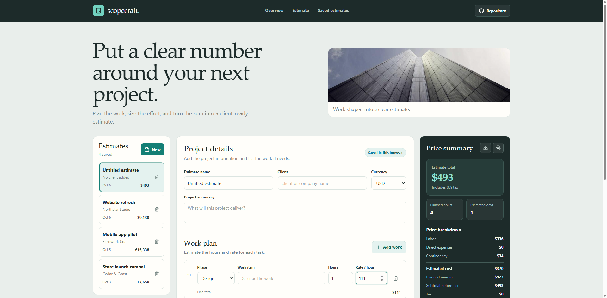

# Scopecraft Project Estimation Tool

Scopecraft is a browser-based workspace for turning a project plan into a clear, itemized estimate. Add the work, set hours and rates, choose pricing assumptions, and review the client price as you make changes.

**Live app:** [https://a2rp.github.io/project-estimation-tool/](https://a2rp.github.io/project-estimation-tool/)

## What it includes

- Three sample estimates for a website refresh, a mobile app pilot, and a store launch campaign.
- A saved-estimate list for creating, selecting, and deleting project estimates.
- Project name, client, currency, and project summary fields.
- Editable work items with a phase, description, hours, and hourly rate.
- Live calculations for labor, direct expenses, contingency, estimated cost, margin, tax, and the final estimate.
- Adjustable direct expenses, contingency, margin, and tax assumptions.
- Planned hours and estimated working days.
- CSV export and a print-friendly estimate view.
- A fixed navigation bar with links to the overview, estimate editor, saved estimates, and public source repository.
- A floating Back to top button that appears after scrolling more than 50 pixels.
- A responsive layout, locally saved project photo, creator links, and support links in the footer.

## Using the estimate workspace

Choose a saved estimate from the list to edit it, or select **New** to start another one. Enter a project name, client, currency, and short summary. Add as many work items as needed, then choose a phase and fill in the task, estimated hours, and hourly rate. The line total updates from hours multiplied by rate.

The price summary updates as you edit the project. Its assumptions can be adjusted directly:

- **Direct expenses** are added to labor before contingency.
- **Contingency** is calculated as a percentage of labor plus direct expenses.
- **Estimated cost** is labor plus direct expenses plus contingency.
- **Margin** is a share of the pre-tax client price. The pre-tax price is estimated cost divided by one minus the margin rate.
- **Tax** is added to the pre-tax price.
- **Estimated days** rounds planned hours up using six working hours per day.

The tax field is a simple percentage input. The app does not apply regional tax rules. Confirm the correct rate and treatment for your project before using an estimate with a client.

Select the download icon in the price summary to export the active estimate as a CSV file. Select the print icon to open the browser print dialog. The print layout includes the project scope and price summary.

Deleting an estimate or a work item opens a confirmation dialog that names the item. Cancel, Escape, or closing the dialog leaves the estimate unchanged.

## Saving and data limits

Scopecraft saves estimates in the current browser's local storage under scopecraft-estimates. Changes are saved automatically as you edit. They remain on this browser and device after a reload, but are not synced to another browser or shared with another person. Clearing this browser's site data removes saved estimates. Export a CSV when you need a separate copy.

The app starts with three sample estimates when no saved estimates exist. It supports USD, EUR, GBP, and INR display formats. Currency values are not converted between currencies. The app assumes six productive working hours per day when it estimates duration. Pricing assumptions can be edited in the summary. Estimates are planning guides rather than a scheduling guarantee.

## Run locally

Install the dependencies and start the Vite development server:

~~~sh
npm install
npm run dev
~~~

## Check and deploy

~~~sh
npm run lint
npm run build
npm run preview
npm run deploy
~~~

The project uses ESLint as its linter. The deploy script runs the production build first, then publishes dist to the gh-pages branch.

**Live app:** [https://a2rp.github.io/project-estimation-tool/](https://a2rp.github.io/project-estimation-tool/)

## Project files

- src/components/estimateEditor/ contains project details and editable work items.
- src/components/estimateLibrary/ contains the saved-estimate list.
- src/components/estimateSummary/ contains pricing assumptions, calculations, CSV export, and print actions.
- src/data/estimates.js contains the sample estimates, estimate factory, storage helpers, and calculation helpers.
- public/images/project-tower.jpg is the local project image used in the interface.
- public/preview.png is the social sharing image.
- screenshot.png is the project screenshot shown at the top of this README.

## Future improvements

These are ideas for later versions and are not implemented:

- Export a styled PDF proposal with project branding.
- Add reusable estimate templates for common project types.
- Save estimates to an account so they sync between devices.
- Add team access, comments, and estimate revision history.
- Add optional tax presets and configurable workday assumptions.
- Compare alternative scopes or pricing scenarios.

## Links

- Portfolio: [https://www.ashishranjan.net](https://www.ashishranjan.net)
- GitHub: [https://github.com/a2rp](https://github.com/a2rp)
- CodePen: [https://codepen.io/ash1198](https://codepen.io/ash1198)
- LinkedIn: [https://www.linkedin.com/in/aashishranjan](https://www.linkedin.com/in/aashishranjan)
- Facebook: [https://www.facebook.com/theash.ashish/](https://www.facebook.com/theash.ashish/)
- YouTube: [https://www.youtube.com/@ashishranjan-ashz?sub_confirmation=1](https://www.youtube.com/@ashishranjan-ashz?sub_confirmation=1)
- Email: [mailto:ash.ranjan09@gmail.com](mailto:ash.ranjan09@gmail.com)

## Support

- Support: [https://a2rp-donation-page.netlify.app/](https://a2rp-donation-page.netlify.app/)
- Buy Me a Coffee: [https://buymeacoffee.com/ashishranjan](https://buymeacoffee.com/ashishranjan)
- Patreon: [https://www.patreon.com/ashishranjan](https://www.patreon.com/ashishranjan)